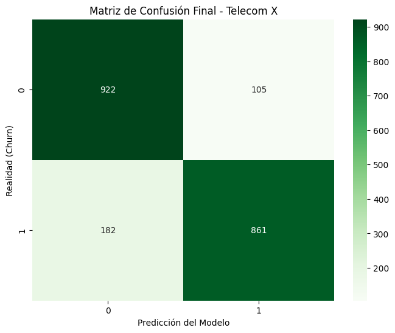

# Carlos-Mendez-Challenge-TelecomX_LATAM-Part2

En esta etapa logramos un Accuracy del 86% usando Regresión Logística y SMOTE.

### Visualización de Resultados

📊 Predicción de Churn - Telecom X (Challenge Alura Latam)
Este repositorio contiene la segunda etapa del Challenge de Data Science, enfocada en la creación, entrenamiento y evaluación de modelos de Machine Learning para predecir la cancelación de clientes (Churn).

🚀 Resumen del Proyecto
El objetivo principal fue desarrollar un modelo predictivo que permita a la empresa Telecom X identificar clientes en riesgo de abandono para tomar medidas proactivas de retención.

🛠️ Herramientas y Técnicas Utilizadas
Lenguaje: Python 🐍

Bibliotecas: Pandas, Scikit-learn, Imbalanced-learn (SMOTE), Seaborn, Matplotlib.

Procesamiento de Datos:

Encoding de variables categóricas (Dummies).

Balanceo de clases mediante SMOTE para manejar el desequilibrio en los datos de Churn.

Escalamiento de variables numéricas con StandardScaler.

Modelo: Regresión Logística.

📈 Resultados Obtenidos
Accuracy Score: 86.14%

Métricas de Evaluación: El modelo presenta un equilibrio sólido entre precisión y recall, permitiendo identificar correctamente tanto a clientes que permanecen como a los que cancelan.

💡 Conclusiones del Análisis
Las variables que más influyen en la cancelación de clientes son:

Tipo de Contrato: Los contratos mensuales (Month-to-month) tienen la mayor correlación con el Churn.

Servicios de Soporte: La falta de soporte técnico y seguridad online incrementa el riesgo de abandono.
